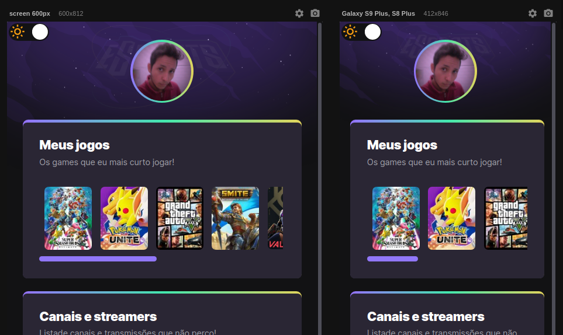
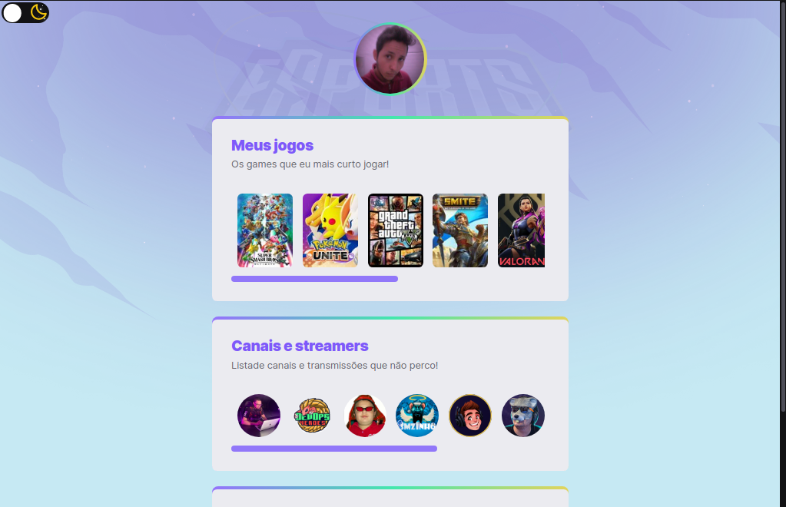

# NLW eSports Explorer

Projeto construído durante o evento Next Level Week(NLW) da Rocketseat, trilha Explorer.  
O projeto consiste em um site agregador de links, feito para gamers compartilhar 
seus jogos, canais e streamers favoritos, é também colocar suas redes.

#  Diferencial
Gostei muito do projeto e resolvi brincar um pouco adicionando pequenas alterações:

- Adicionado scrollbar horizontal nas listas, através da propriedade overflow-x.
- Alterado os estilos dos scrollbars através do pseudo-elemento webkit-scrollbar.
- Adicionado botão switch para trocar o tema do site, no caso para um tema mais claro.

Projeto: https://leonardoxp9d.github.io/nlw-esports-explorer/

Projeto Original: https://maykbrito.github.io/nlw-esports-explorer/

## 🛠 Tecnologias
- HTML
- CSS
- Javascript
- Git e Github

## ✉️ Contato
leonardo.soares.lim@gmail.com

